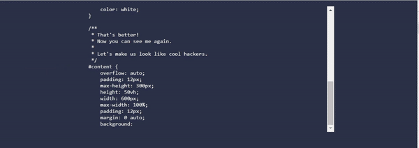

# Self-Coding Website
Website that will style itself with a simple technique. By using the `contenteditable` attribute on a style block and giving it just the initial styling of `display:block;` you can now both see and change the CSS styling of your website. It's as simple as this:
```html
<style contenteditable style="display:block;">
/*You can now both see and change the styling of this block */
body {
    color: red;
}
</style>
```

When you add one simple function for auto-typing content into the style block (see `type` function in *index.html*) you can already achieve a self-coding website that styles itself.

## Live Demo
https://laurensv.github.io/self-coding-website/

## Screenshot
[](https://github.com/laurensV/self-coding-website/blob/main/docs/self-coding-website-snippet.mp4?raw=true)
